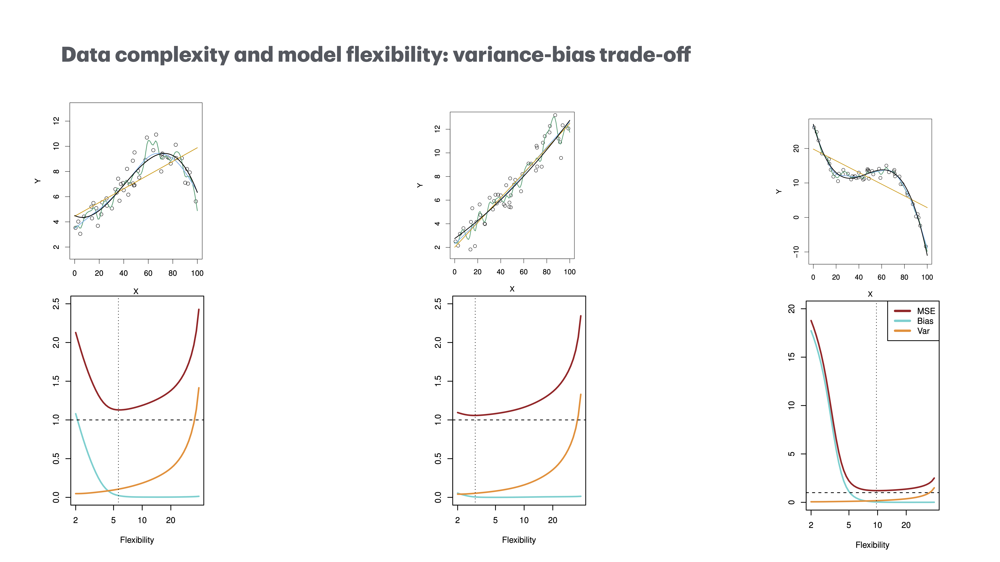

```{r setup, include=FALSE}
knitr::opts_chunk$set(echo = TRUE,
                      message = F,
                      warning = F)
```

```{r}
library(knitr)
```


## 2.1 What Is Statistical Learning? 

Advertising data/Income data

- Quantitative, Y and predictors X_i and error term

$$
Y = f(X) + \epsilon
$$

Statistical Learning, estimating $f$, error $\epsilon$ will be with the estimation. 

### 2.1.1 Why Estimate f?

For prediction and inference. 

Prediction as $\hat{f}$: 

$$
\hat{Y} = \hat{f}(X)
$$

No error term

But We can't minimize error to zero because of the error composion: 

$$
\begin{align}
\text{E}(Y - \hat{Y}) &= E[f(x) + \epsilon - \hat{f}(X)]^2 \\
&=[f(X) - \hat{f}(X)]^2 + \text{Var}(\epsilon)
\end{align}
$$

Irreducible error comes with randomness. and Flexible models will chase the noise, leading to overfitting. 

### 2.1.2 How Do We Estimate f

Apply a statistical learning method to training data to estimate the unknown function $f$--we believe every observation in this world is a function. We are trying to approximate: 

$$
Y \approx \hat{f}(X)
$$

Parametric and non-parametric methods: 

### Comparison of Parametric and Non-Parametric Methods

| Feature                      | Parametric Methods                  | Non-Parametric Methods          |
|------------------------------|-------------------------------------|---------------------------------|
| **Number of Parameters**     | Fixed                               | Grows with data size            |
| **Assumptions**              | Strong assumptions about data form  | Few assumptions about data form |
| **Complexity**               | Simpler, fixed structure            | Flexible, adaptive structure    |
| **Computational Efficiency** | Generally more efficient            | Generally less efficient        |
| **Risk of Overfitting**      | Lower risk                          | Higher risk                     |
| **Interpretability**         | More interpretable                  | Less interpretable              |


### 2.1.3 The Trade-Off Between Prediction Accuracy and Model Interpretability

### 2.1.4 Supervised Versus Unsupervised Learning

### 2.1.5 Regression Versus Classification Problems

## Assessing Model Accuracy

### 2.2.1 The mean squared error (MSE)

$$
MSE = \frac{1}{n}\sum_{i = 1}^{n}(y_i - \hat{f}(x_i))^2
$$

### 2.2.2 Variance-bias trade-off: 

$$
\begin{align}
E(y_0 - \hat{f}(x_0))^2 &= \text{Var}(\hat{f}(x_0)) + [\text{Bias}(\hat{f}(x_0))]^2 + \text{Var}(\epsilon)
\end{align}
$$

Variance measures the model's sensitivity to the training data. A high variance model tends to overfit the data, capturing noise along with the underlying pattern.

Bias arises when the model is too simplistic and fails to capture the underlying trend in the data.A high bias model tends to underfit the data, missing relevant relations between features and target outputs.

This is the noise inherent in the data. It represents the lowest possible error that cannot be reduced by any model.


```{r}

```

### 2.2.3 The Accuracy in Classification Setting

Error rate: Proportion of mis-classified cases. 

$$
\frac{1}{n}\sum_{i = 1}^{n}I(y_i \neq \hat{y}_i)
$$

## The Bayes Classifier: 

### 1. Bayes' Theorem

$$
P(C_k|X) = \frac{P(X|C_k)\cdot P(C_k)}{P(X)}
$$

### 2. Bayes Classifier produces the lowest error rate: 

$$
\hat{y} = \text{argmax}_{C_k}P(C_k|X)
$$

Choose the class with the highest posterior probability, and the overall error rate will be minimized. 

$$
1 - E\bigg(\underset{j}{\max}{\Pr}(Y = j|X)\bigg)
$$

### 3. A visualization to show the decision boundary. 

### Breast Cancer Example Using Bayes Classifier. 

1. Prior probability: 
$P(Maligant) = 0.3$; $P(Benign) = 0.7$

2. Likelihoods: 

$P(X|Malignant) = 0.2$: The likelihood/probability to observe the feature value $X$ if the case is malignant; 

$P(X|Benigh) = 0.1$: The likelihood/probability to observe the feature value $X$ if the case is benign; 

3. Marginal Probability: total probability of of feature X

Comes from: 1) malignant with feature X; 2) Benign with feature X

$$
\begin{align}
P(X) &= P(X|Malignant) \cdot P(Malignant) + P(X|Benign) \cdot P(Benign) \\
&= 0.2 \cdot 0.3 + 0.1 \cdot 0.7 \\
&= 0.13
\end{align} 
$$

4. The posterior probability of each class given feature X. 

Probability to be Benigh: 

$$
\begin{align}
P(Benigh|X) &= \frac{P(X|Benign) \cdot P(Benigh)}{P(X)} \\
&= \frac{0.1 \times 0.7}{0.13} \\
&\approx 0.538

\end{align}
$$

Probability to be malignant: 

$$
\begin{align}
P(Malignant|X) &= \frac{P(X|malignant) \cdot P(Malignant)}{P(X)} \\
&= \frac{0.2 \times 0.3}{0.13} \\
&\approx 0.462

\end{align}
$$

In summary: 

Assign the observed case with feature $X$ to the most likely class. 

Reference: 

The Wisconsin Breast Cancer Dataset (WBCD): 

Rousseeuw, P. J., & Croux, C. (1995). "Alternatives to the Mean Absolute Deviation." Journal of the American Statistical Association, 90(429), 1394-1404.

Witten, I. H., & Frank, E. (2005). Data Mining: Practical Machine Learning Tools and Techniques (2nd ed.). Morgan Kaufmann. (Includes discussion of the WBCD dataset and Naive Bayes classification).

## K- NearestNeighbors

$$
{\Pr}(Y = j | X = x_0) = \frac{1}{K}\sum_{i \in \mathcal{N}_{0}}I(y_i = j)
$$

Left of equal sign: 

$Y = j$: class label $Y$ equal to the $jth$ class, which is one of the possible class; 

$X = x_0$: instance $x_0$ in feature space $X$; 

Left of the equal sign: Given the feature $x_0$, the probability of $x_0$ that in $jth$ class. 

Right of equal sign: 

$K$, K neighbors that are nearest of $x_0$, $K$ is a hyperparameter

$\mathcal{N}_0$: set indices of the K neighbors from 1 to K

$I(y_i = j)$: indicator function that equals 1 if class label $y_i$ of the $ith$ neighbor is j, i.e., among the K neighbors, if the $ith$ point belongs to $j$ class, the function $I$ is 1. 

$\sum_{i \in \mathcal{N_0}}I(y_i = j)$: the number of neighbors among the K nearest neighbors whose class label is $j$. 

In summary: 

Choose Hyperparameter K; 

Identify the K Nearest Neighbors; 

Calculate the Probability of Each Class

Assign the Class with the Highest Probability


## Lab: Introduction to R

```{r}
x <- rnorm(100)

y <- rnorm(100)

plot(x, y)
```

```{r}
x <- seq(-pi, pi, length = 50)

y <- x

f <- outer(x, y, function(x, y) cos(y) /(1 + x^2))

contour(x, y, f)

contour(x, y, f, nlevels = 45, add = T)

fa <- (f - t(f)) / 2

contour(x, y, fa, nlevels = 15)
```

## Exercise

1-1: 
a. sample size n is extreme large, number of predictor p is small: 

Variance: large sample size reduce variance; 
Bias: small number of predictors do not need too much flexibility
Flexible model works well. 

b. small n, extremely large p. 

Variance: large; bias: 

Inflexible model works well to control variance. 

c: Highly non-linear: 

flexible model to mimic the non-linear shape. 

d: error term is high

inflexible model to prevent the model from chasing noise. 
